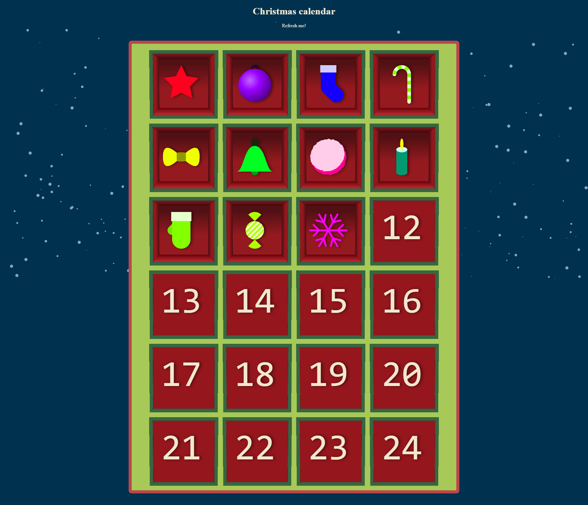
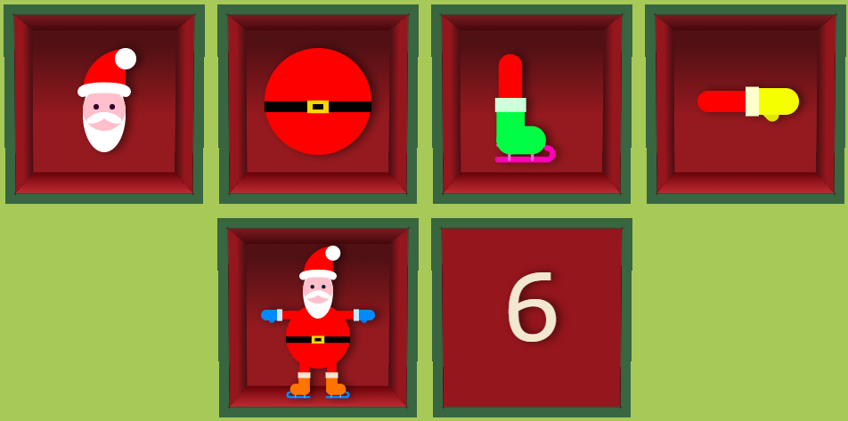
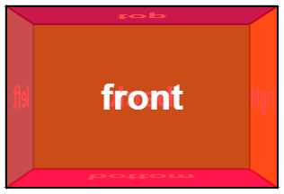
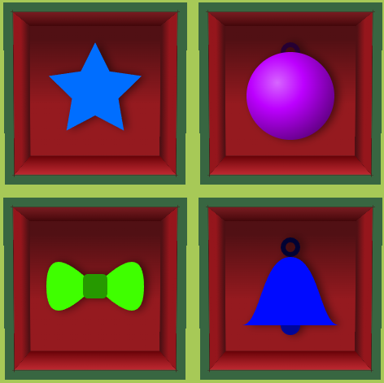

# Christmas calendar
A christmas calendar filled with Javascript generated christmas items.

## Calendar course
I followed this course learning about:
- Coordinates
- Basic math
- Various JavaScript thechniques
- Modularity
- Reusability
- Consistency

After the 24 day course, to master the skill of drawing in a canvas using math. I build myself a Santa, reusing previous build components: the skate & the glove.
Result:

## Snow background course
I followed this course learning about:
- Basic math
- Various JavaScript thechniques

## 3d boxes
I used a codepen example of a 3d box. I then customized it and applied a box to all items & numbers.

codepen box:

Customized result:

## Links
Course links:
- [Youtube - Calendar](https://www.youtube.com/playlist?list=PLB0Tybl0UNfalh9Ll82j6OKdx1QINOZom)
- [Github - Calendar](https://github.com/gniziemazity/christmas_calendar)
Snow tutorial:
- [Youtube - Snow background](https://www.youtube.com/watch?v=JG7B4W9HeOw)
3D box:
- [Box example](https://codepen.io/desandro/pen/MGpMOV)